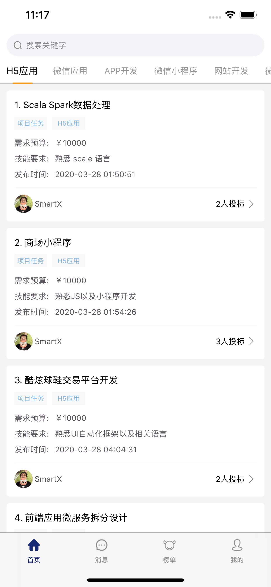
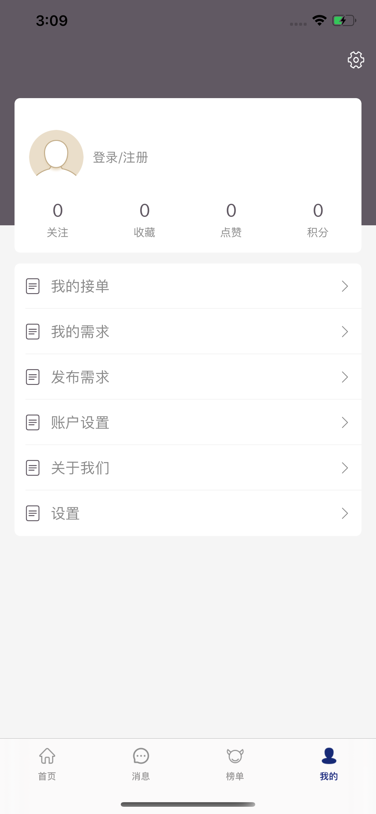

# mt-ios

【账户到期，应用已下架】类似于开源众包的 IOS APP, 您可以在上面发布需求, 或者帮助他人解决需求，已发布到 Apple Store 应用商店，搜索 `小前端` 即可下载。

您也可以通过访问网版访问：http://micro.airtlab.com

主要包含以下模块：

- [x] 用户
- [x] 签到
- [x] 积分
- [x] 需求
- [x] 收藏
- [x] 订单
- [x] 评论

## 功能介绍

## 版本历史

### 1.0 
1. 用户注册登录；
2. 发布需求等等；
### 1.1
1. 修复首页需求列表时间展示错误的BUG；
2. 修复消息页面登录状态不同步的BUG；
3. 修复设置页面跳转到 APP Store 链接错误的BUG;
4. 更换首页APP预览图；
